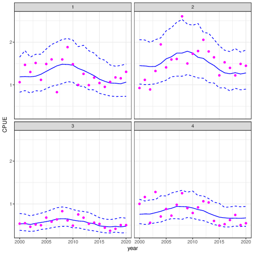
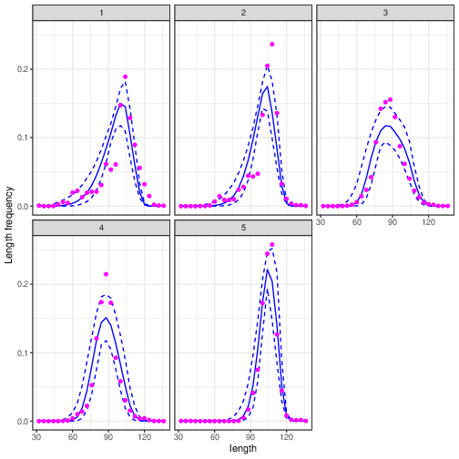
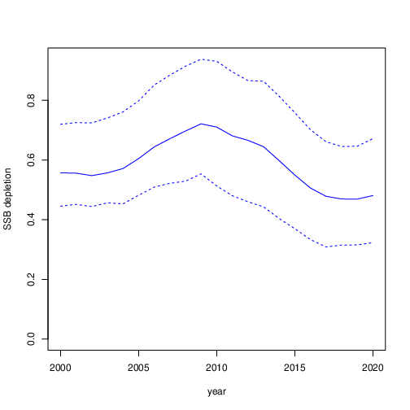
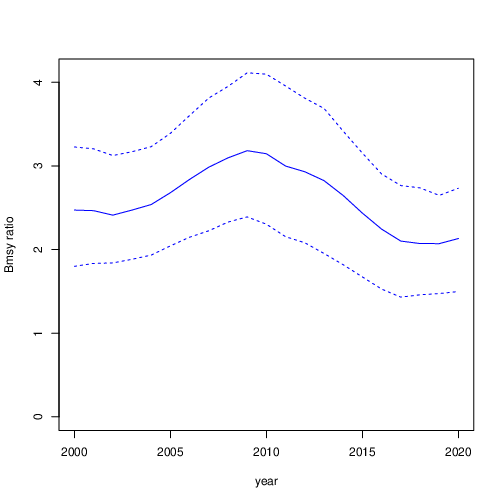
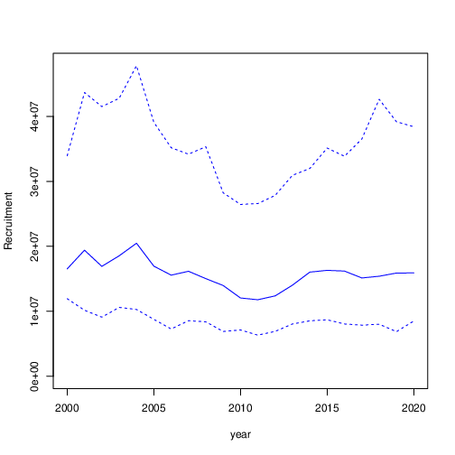
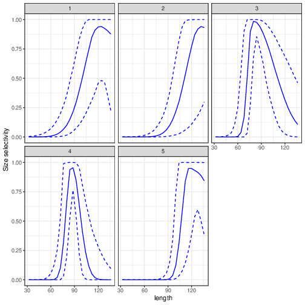
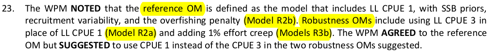
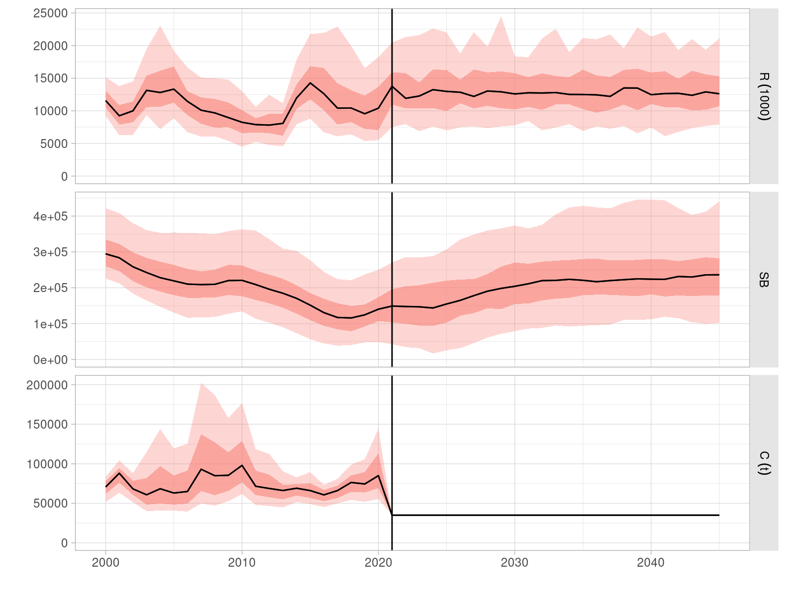
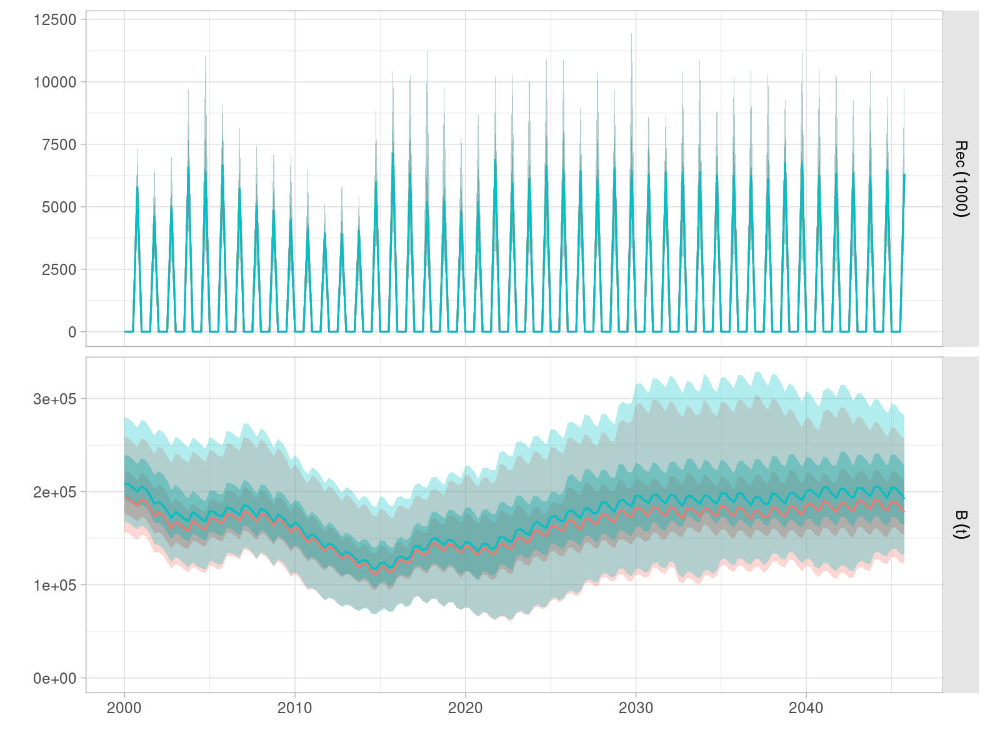

## Introduction

# Conditioning of Operating Models

## The ABC algorithm

## Operating Models

# Management Procedures

## Candidate MPs

# Management objectives

## Tuning objectives

## Performance statistics

# Work status and plan

## Timeline of work

## ABC OMs

### Biology

- Age, sex and quarterly structured population model
- Timeline: 2000 to 2020 (covers all existing cohorts)
- Beverton-Holt with exploited equilibrium initialisation
- Reproduces stock status variables: $SB_{MSY}$, $H_{MSY}$, depletion to $SB_0$

### Fisheries

- Merges ``common'' seasonal LL fleets 1--4
- Retains single PS and ``Other'' fleet: 6 in total
- Size data from LL and PS data (aggregated across time)
- LL CPUE from a given fleet / area

## ABC uncertainty

- Steepness \& $M$: covariance joint prior (not discrete grid)
- $\sigma^2_r$: (i) fixed at 0.3; (ii) estimated with prior CI 0.2--0.5  
- LF: weight/influence (aggregating and ABC discrepancy) 
- LL catchability: alternative 1\% annual increasing trend
- CPUE series: seasonal $q$ using fleet 1 and 3 \emph{separately}

## OM - Fits to CPUE series & LF

{ width=49% }
{ width=49% }

## OM - Population dynamics

:::::::::::::: {.columns}
::: {.column align="center" width="33%"}
{ width=99% }
Depletion
:::
::: {.column align="center" width="33%"}
{ width=99% }
$B/B_{MSY}$
:::
::: {.column align="center" width="33%"}
{ width=99% }
Recruitment
:::
::::::::::::::

## OM - Size selectivity

{ width=70% }

## OM grid

- **R1** CPUE fleet 1, SSB but *not* $H_{MSY}$ priors
  - CPUE fleet 3 (**R1a**)
  - Overfishing penalty (**R1b**)
- **R2**, R1 + estimated $\sigma^2_r$
  - CPUE fleet 3 (**R2a**MSY)
  - Overfishing penalty (**R2b**)
- **R3** R1 + 1% effort creep
  - CPUE fleet 3 (**R3a**)
  - Overfishing penalty (**R3b**)

## Robustness OMs (WPM15

{ width=80% }

## OM projections - C = 35,000 t

{ width=80% }

## OM projections - C = 35,000 t

{ width=80% }

## Reference points

- $SB/SB_{MSY}$ and $F/F_{MSY}$ computed over each season
- $P(Kobe=green)$ computed across all seasons and iter per year
- $SB_0$

## Experimental design

- Reference OM (R2b): LL CPUE 1 (NW), SSB prior, recruitment variance, F penalty.
- Robustness OMs (R3b): 1% effort creep.
- Robustness tests
    - Low vs. high future recruitment regimes
    - Faster growth, and maturity, lower max size
    - Larger recruitment variability
    - CPUE precision & bias, hyper-stability
    - Implementation error (?)
- Tuning for 50, 60 and 70% P(Kobe=green)
- CPUE LL1 + buffer HCR MP
- JABBA (LL1) + buffer HCR

## Current status

- OM grid finalized
  - Update OMs to 2023, project catch
- Both MPs coded and running
- Bug in projection code, review ongoing
    - Only asparent while running MPs
    - Initial years target catch not achieved

## Timeline

- Demonstration set tuned MPs and robustness runs
    - Not ready for TCMP deadline
    - Extra time available?
- Presentation to WPMTmT, comparison with assessment
- Updated complete analysis to WPM
