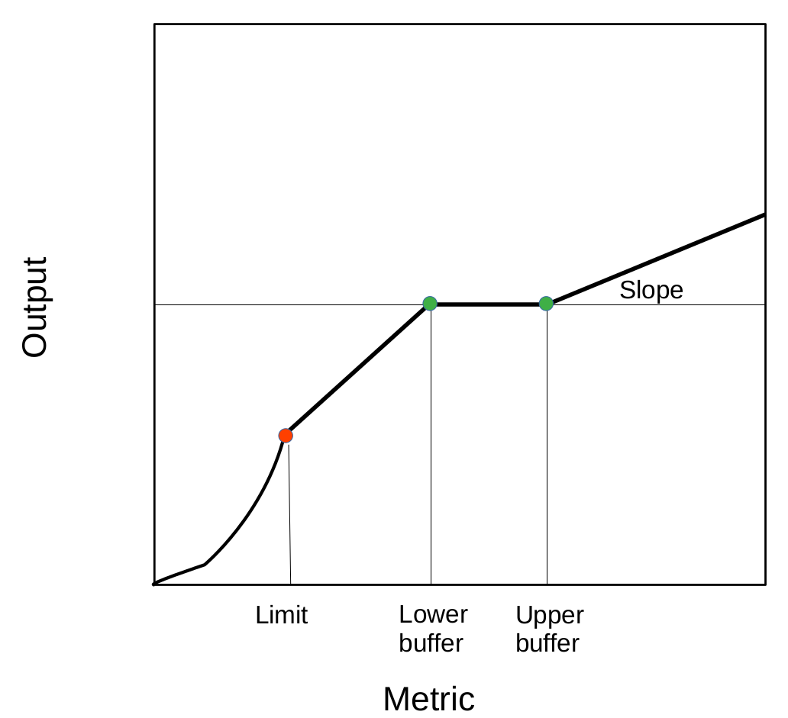

## Development of albacore MSE using ABC OMs

- Progress of work from 2025 WPM MSE
- Base case and robustness OMs finalized
- Proposal for update of OMs to new data WPTMT 2025
- Tested model-free MPs, tuning to be finalized
- Robustness OMs plus climate change scenarios
- Tests of model-based MP
- Observation error scenarios

# Operating models

## OM model structure: population dynamics

- Timeline is 2000 to 2020 (2023), all existing cohorts
- Age, sex and quarterly structured population model
- Beverton-Holt with exploited equilibrium initialisation
- Designed around simplified version of assessment model structure
- Reproduces key stock status variables:
  - MSY variables: $SB_{MSY}$, $HR_{MSY}$
  - Depletion relative to $SB_0$

## OM model structure: fishery dynamics

- Model considers 4 LL fleets, each with seasonal catch, effort and size data.
- One PS fleet and one *Other* fleet, 6 in total.
- Size data from LL and PS is aggregated across time.
- Single LL CPUE as index of abundance (NW or SW)
- Seasonal *vs.* annual catchability explored

## ABC

- Status priors from assessment
  - Relative SSB
  - $B_{MSY}$ ratio
  - $HR_{MSY}$ ratio
  - Overfishing penalty
- Integrates status information with LF \& CPUE data
- Axes of uncertainty
  - Steepness \& $M$: covariance joint prior (not discrete grid)
  - $\sigma_R$: (i) fixed at 0.3; (ii) estimated with prior CI 0.2--0.5  
  - LF: weight/influence (aggregating and ABC discrepancy)
  - LL catchability: alternative 1\% annual increasing trend
  - CPUE series: seasonal $q$ using fleet 1 and 3 \emph{separately}

## Base case OM

- LL CPUE1 (NW), SSB priors, recruitment variability, and overfishing penalty

\fig[0.80]{data_om_basecase.png}

## WPTmT SA 2025

- Updated catch series, up to 2023
- New indices of abundance

\fig[0.80]{data_sas_compare.png}

## NW LL CPUE indices of abundance, 2022 & 2025

\fig[0.80]{data_id1_compare.png}

## OM update

- Conditioned OM, same selectivities & biology
- Projected for updated nominal catch 2010-2023
- Recruitment predicted from original SRR and LN deviances ($\sigma_R$, $\rho$)
- LL CPUE reconstructed from new biomasses and previous selectivities

## Conditioned and updated base case OM

\fig[0.80]{data_oms_compare.png}

## Updated OM and stock assessment scale

\fig[0.80]{data_om_compare_sa.png}

## Updated OM and stock assessment scale

- SB0 131,315 t (2022) 121,296 t (2025)

\fig[0.80]{data_om_compare_sb0.png}

# Management procedures

## Constant catch tuned MP

- Tuned to P(Kobe=green)=60% in 2034-2038
- C = 40,000 t. C(2023) = 41,806 t

\fig[0.80]{model_ccatch.png}

## Contact catch tune MP, lessons learned

- Current CPUE likely at desired level
- Catches might need increasing to achieve targets
- Little catch variation needed to tune, but
- MP needs to react quickly after increases in catch
- Reference from years when assessment says stock is at FMSY

## Model-free MP: CPUE + buffer HCR

- TAC multiplier ~ index
- Target catch level at around current
- Buffer width and position for potential tuning.

```{r buffer.hcr, out.width="65%", fig.align="center", echo=FALSE}

```

## Harvest rate as exploitation metric

- Exploitation level metric, $C / VB$
- Computer quarterly by fleet, limited to 90%
- Annual metric is average over quarters of sum over fleets

$$ HR = \sum_{s=1}^{4} (\sum_{f=1}^{6} (C_{fs} / \sum_{a=0}^{14}(N_as \cdot W_as \cdot S_{fas}))) / 4 $$

# Status of work

## Next steps

- Finalize tuning of the proposed model-free MP.
- Run and tune model-based MP, JABBA + buffer.hcr(multiplier ~ depletion)
- Finalize climate-change robustness scenarios
- Test the tuned MPs on the robustness OMs
- Test MPs under some observation error scenarios for total catch.
- Report to WPM and WPTmT by end of 2025.

## Questions

- Is the update of OM sufficient?
- Any potential alternative MP option?

## Acknowledgements

- Work by IM is being funded by the Indian Ocean Tuna Commission (IOTC/FAO).
- Work by RH is being funded by the Department of Foreign Affairs and Trade of the Government of Australia.

\vfill\centering
\includegraphics[height=1cm]{boot/initial/report/WUR.png}
\includegraphics[height=1cm]{boot/initial/report/CSIRO.png}
\includegraphics[height=1cm]{boot/initial/report/IOTC.png}
\includegraphics[height=1cm]{boot/initial/report/FAO.png}
