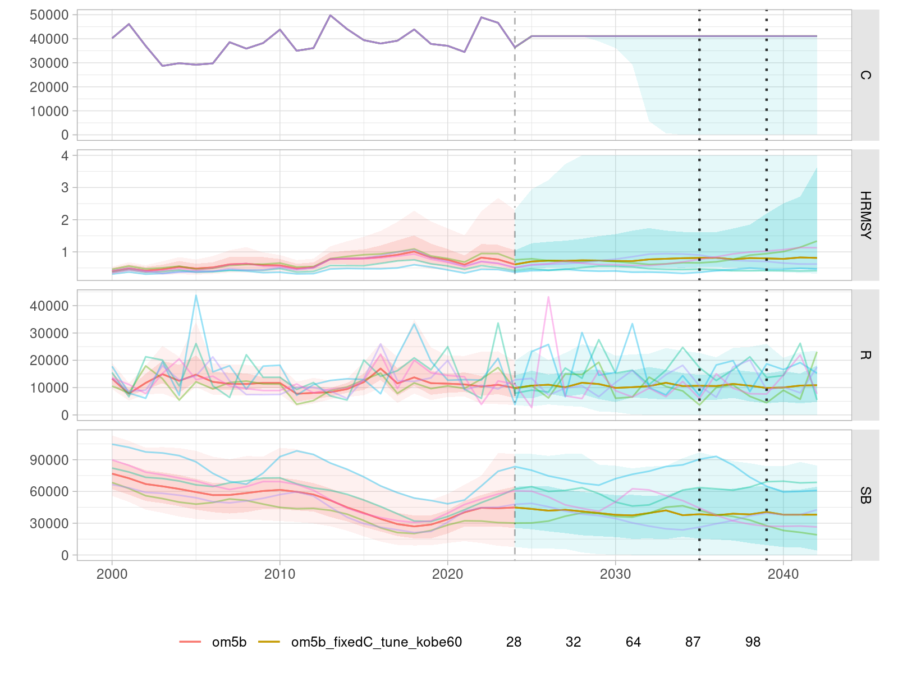

```{r setup, echo=FALSE}
library(knitr)
opts_chunk$set(echo=FALSE, message=FALSE, warning=FALSE,
  out.width="75%", fig.pos='hbt', fig.align="center")
```

# Executive Summary

# Introduction

## Stock Overview

- Map distribution

## Commercial exploitation

## Scientific advice

- Catch limits or other management measures
- Compliance

## MSE Background

- Process
- Decisions
- Work carried out & presented

## Objectives

- Management objectives: overall IOTC MSY objective, other MPs
- Tuning objectives
- Secondary objectives

# Methods

## Simulation and Evaluation Framework

- ADD MSE simulation workflow

## Operating Models (OMs)

- DESCRIBE OM structure

- TABLE OMs tested

### Conditioning

- DESCRIBE input data

#### Operating model update

- New dataset for [@WPTmT_2025] assessment
  - Updated annual nominal catch series from 2010
- Differences in catch not large enough to affect productivcity estimates, thus no full re-conditioning
- **PLOT** Comparison SS3 runs

```{r data-sas-compare, fig.cap="Time series of annual recruitment, spawning stock biomass, catch and fishing mortality estimated by the 2022 and 2025 NW LLCPUE stock assessment model runs for Indian ocean albacore tuna."}
knitr::include_graphics("report/data_sas_compare.png")
```

- 2025 SS3 model not fully endorsed, problems.

- Conditioned OM updated to 2024 by
  - Projecting forward using the new catch series 2010:2024
  - Recruitment deviances from the conditioned OM used in 2022 assessment, on top of SRR with new SSB 2010-2020, and from future deviances (LM, sigmaR and rho by sample) 2021-2024
  - Proportions by quarter kept as in projection set up, no changes between the two datasets, constant in time (Fiigure \@ref(fig:data-sas-catchprops))

```{r data-sas-catchprops, fig.cap="Annual proportion by season of the total catch for Indian ocean albacore tuna, obtained from the inputs to both the 2022 and 2025 stock assessment model runs."}
knitr::include_graphics("report/data_sas_catchprops.png")
```

- Updated observations of abundances and indices

- **PLOT** Comparison updated and original OMs

- **PLOT** Comparison updated and original indices

### Reference set

- DESCRIBE om5b

### Robustness set

- DESCRIBE om6b

### Climate change

- DESCRIBE CC

## Observation Error Model (OEM)

- Catch
- Indices

## Future Projections

## Candidate Management Procedures (MPs)

### Estimation Methods

### Harvest Control Rules

#### HCR A

- HCR diagram

### # Implementation System

## Implementation Error Model

## Simulations

### Experimental Setup

### Performance statistics

- *SB*, Spawner biomass.
- *SB/SB[0]*, Spawner biomass relative to unfished.
- *min(SB/SB[0])*, Minimum spawner biomass relative to unfished.
- *SB/SB[MSY]*, Spawnwer biomass relative to SBMSY.
- *R*, Recruitment.
- *HR*, Annual relative harvest rate, computed as an seasonal average of the sum of the harvest rates by fishery over the HR at MSY reference point, $\sum_{f=1}^{6} HR_{f} / HR_{MSY}$.
- *P(Green)*, Probability of being in Kobe green quadrant, $SB > SB_{MSY} \land HRMSY < 1$.
- *P(Orange)*, Probability of being in Kobe orange quadrant, $SB > SB_{MSY} \land HRMSY >= 1$.
- *P(Yellow)*, Probability of being in Kobe yellow quadrant, $SB <= SB_{MSY} \land HRMSY < 1$.
- *P(Red)*, Probability of being in Kobe red quadrant, $SB <= SB_{MSY} \land HRMSY >= 1$.
- *P(SB>=SB[MSY])*, Probability of SB greater or equal to SBMSY.
- *P(SB>SB[limit])*, Probability that spawner biomass is above 10% SB0.
- *C*, Total catch.
- *C/MSY*, Proportion of MSY.
- *AAV(C)*, Annual variability in catch.
- *IAC(C)*, Percentage inter-annual change in catch, $(C_{y-1} - C_{y}) / C_{y}$.
- *P(shutdown)*, Probability of fishery shutdown, taken to be when catch falls below 1% of MSY.

# Results

## MP runs

### Constant catch MP

- Constant catch MP, catch level tuned to P(Kobe=green)=60%

```{r model-fixedC-tune-timeseries, fig.cap="Time series of annual recruitment, spawning stock biomass, catch and fishing mortality estimated by the 2022 and 2025 NW LLCPUE stock assessment model runs for Indian ocean albacore tuna."}

```


## MP Performance

- COMPARE MPs with CC MP

# Discussion

## Management Implications 

## Limitations

## Conclusions

# References

# Appendix A: Operating model

## Parameter definitions

The key estimated parameters in the Operating Model conditioning code are:

 + Unfished SSB, $B_0$
 + Initial exploited equilibrium depletion
 + Deviations from the stock-recruit curve
 + Selectivity parameters for each of the fleets

The steepness, $h$, and (quarterly) natural mortality parameter, $M$, are defined a bivariate correlated prior that is merged with the estimated parameter posterior using a Gibbs sampling scheme.

## Age-structured dynamics

The population dynamics are seasonal (quarterly) and sex-structured, where an exploited equilibrium initial state is assumed. Recruitment is at age 0 and is defined to occur in a specific (single) season.

## Stock-recruitment relationship

A Beverton-Holt stock-recruit relationship is assumed and the steepness/unfished SSB parameterisation is utilised. Annual deviations to the expected recruitment are included and are defined a log-normal prior of mean zero and standard deviation $\sigma_r$. A 50/50 sex ratio-at-spawning is assumed.

## Length-at-age

We assume the same underlying distribution of length-at-age as that used in the stock assessment which is sex-specific and with seasonal effects included.

## Length-weight relationship

We assume the same underlying length-weight relationship as that used in the stock assessment.

## Maturity

We assume the same maturity-at-age, which varies by sex and season, as that used in the stock assessment.

## Biomass quantities

The most important biomass quantity, the SSB, is defined as being the female spawning biomass and is the quantity used in the stock-recruit relationship and $B_0$ refers to that unfished level. Exploitable biomass, used to calculate exploitation rates (see following subsection) utilises the seasonal weight-at-age defined using both the length-at-age and weight-at-length relationships.  

## Exploitation rate

Exploitation rate, not fishing mortality, is used to define the catch equation in the fishery part of the OM. To calculate the exploitable biomass the numbers-at-age at the start of each season are multiplied by weight-at-age and selectivity-at-age and summed across ages. The fishery catch biomass is then divided by the exploitable biomass to calculate the overall fishery-specific exploitation rate (which is capped at 0.9). To finally get the exploitation rate-at-age for each fishery (which defines the catch-at-age when multiplied by numbers-at-age) the overall exploitation rate is multiplied by the selectivity-at-age.

## Abundance indices

To calculate model-predicted abundance indices the exploitable biomass of the fishery for which we assume the CPUE is an abundance index is multiplied by a (possibly seasonal) catchability parameter. The catchability parameters are estimated using the nuisance method assuming a log-normal likelihood function.


# Appendix B: Harvest Control Rules

## HCR A

### Exploration

