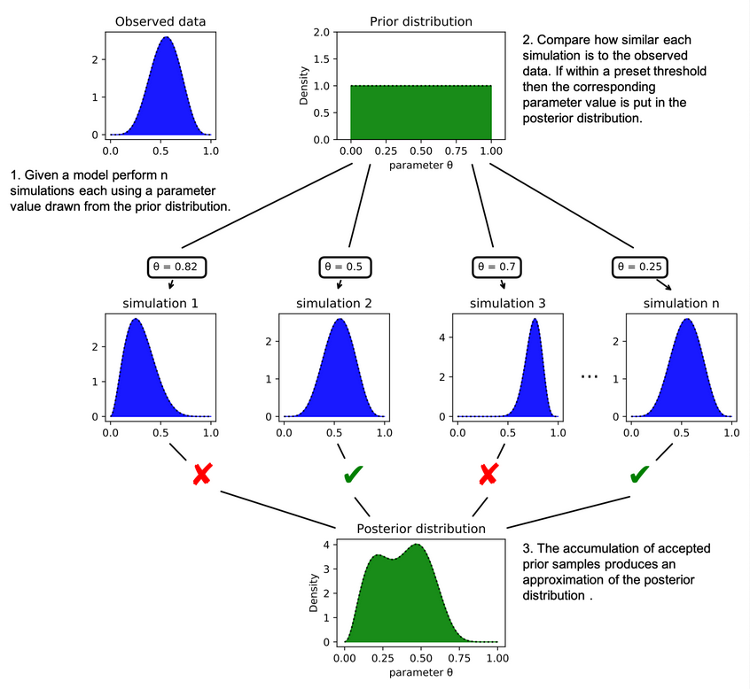
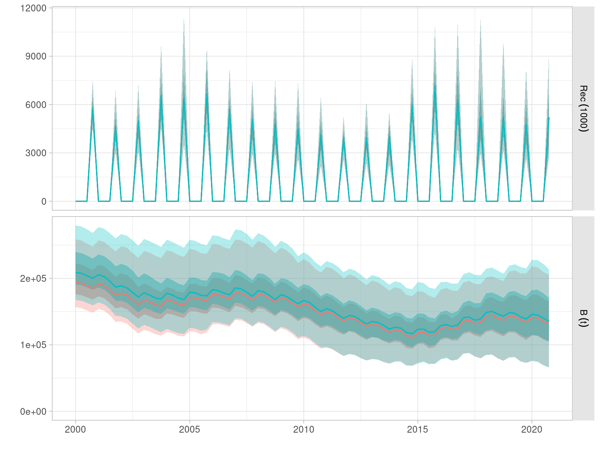
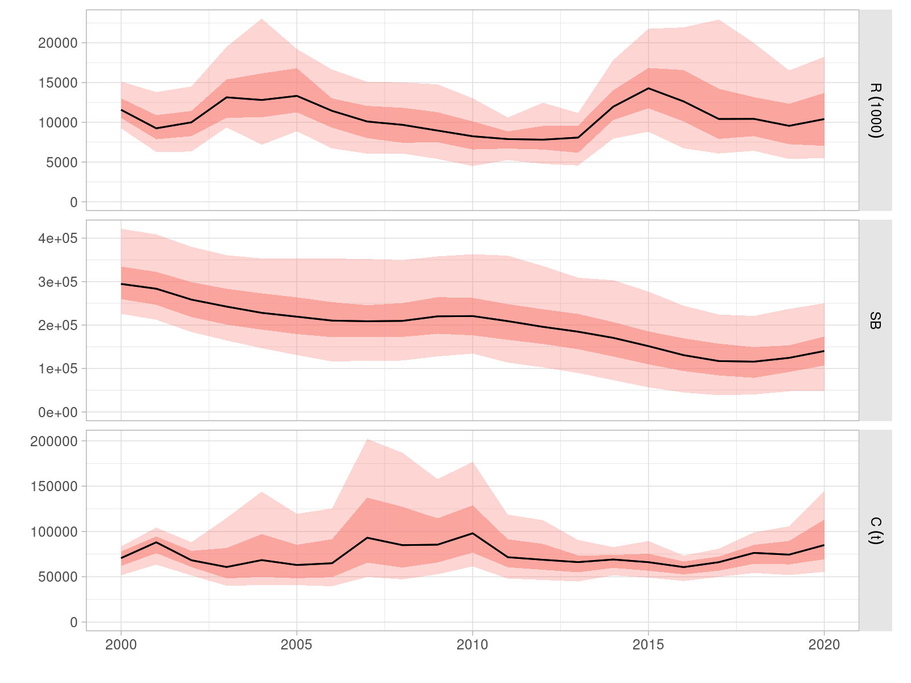
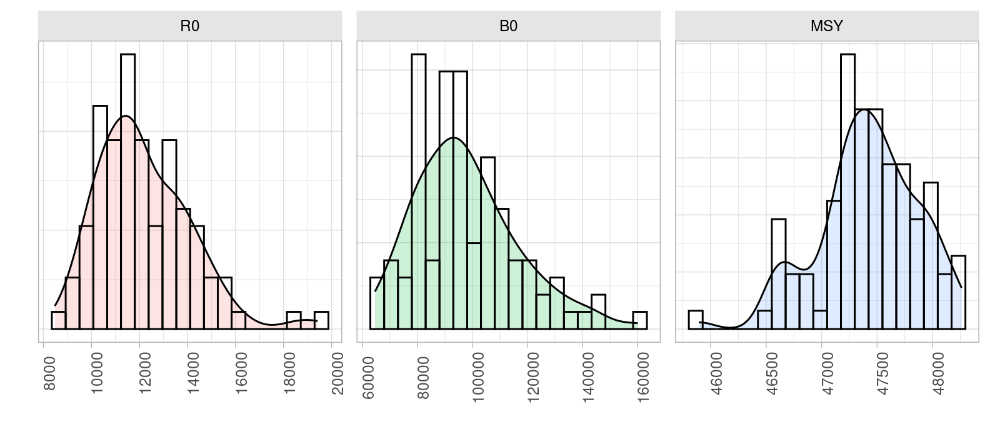
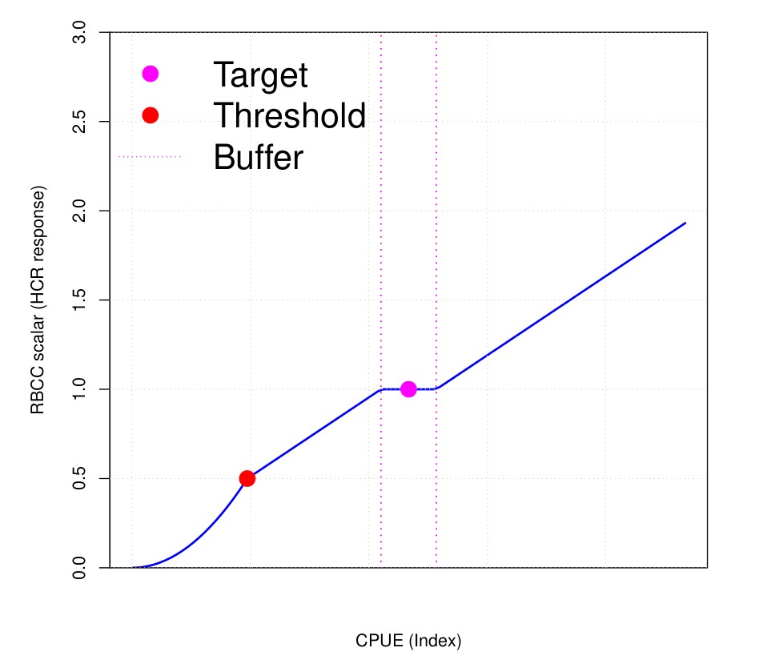

```{r, knitr, echo=FALSE, message=FALSE}
library(knitr)
opts_chunk$set(echo=FALSE, message=FALSE, warning=FALSE, fig.align="center",
  fig.width=5, fig.height=3, fig.pos='htb', out.width="60%")
```

$\nocite{Leyshon_2021}$

# Introduction

The development of Management Strategy Evaluation (MSE) analyses for Indian ocean albacore is about to embark on it final phase. An updated set of operating Models (OMs) has been conditioned applying a novel methodological approach that has solved the problems encountered with the previous set, based directly on the stock assessment.

Some technical difficulties have delayed the evaluation of candidate Management Procedures (MPs), which still require a round of review by the Working Party on Methods of IOTC before being ready for presentation to TCMP.

The current document reports on the main features of the approach taken when conditioning OMs for this stock, presents some initial results, and indicates the next steps of work. The feedback of TCMP is required of the planned set of management objectives to be explored.

# Conditioning of Operating Models

Operating Models for IOTC stocks have been assembled following two alternative methods. A grid of model runs, formulated using a set of alternative assumptions and inputs, is constructed around the base case assessment model. The OMs for bigeye, swordfish and skipjack have all followed this approach. Conditioning can also be based on a suite of possible prior states of historical dynamics and current status, as well as an evaluation of their credibility. The previous MSE analysis for skipjack tuna [@Bentley_2015], for example, employed a method of this kind [@Bentley_2012].

The current OM for albacore follows the later approach [@Hillary_2024a], by using the more recent data within an estimation scheme built on emerging Approximate Bayesian Computation [ABC, @Sunnaker_2013] and Synthetic Likelihood [SL, @Wood_2010] concepts. The aim is to generate a probability distribution of current abundance, mortality and status that is consistent with both the available data and a suite of possible prior states of nature defined beforehand, some of them informed by the stock assessment results. This set of recent dynamics can then be used to initialise the OMs used to project the stock into the future, and test the candidate MPs.

## The ABC algorithm

An summary diagram of the ABC algorithm is presented in Figure \@ref(fig:abc). Observed data, in this case total catch, length frequencies in the catch and the CPUE indices of abundance, is combined with prior distributions for a number of parameters, such as steepness and natural mortality. Each set of parameters gives rise to a population trajectory that can be compared to the observed data. The discrepancy between the two is used to decide on whether any in individual simulation is accepted or rejected. A final posterior of population trajectories and dynamics is then obtained that will form the basis for the OM.

```{r abc, fig.cap="Schematic diagram of a simplifed ABC process to estimate the posterior distribution of a model parameter (Leyshon, 2021)"}

```
The axes of uncertainty included in the assembled OMs for albacore covers those previously explored in the stock assessment based OMs presented in the previous suite of OMs [@Mosqueira_2021]:

- Use of - and generation of data from - alternative CPUE series
- Influence of size data on estimates
- Impact of assumed catchability increases in LL fleets
- Uncertainty in stock-recruitment steepness and natural mortality
- Uncertainty in recruitment variability

The OMs intend to characterize the dynamics and uncertainty of the stock alive today, rather than a reconstruction of all its history. Only the last 21 years of data are thus used in the analysis. Finally, a more pragmatic approach to fisheries structure was taken, limiting the number of fisheries and aggregating data in time so as to increase their information content. The final model structure is as follows:

- Annually structured but with four seasons and recruitment in a single pre-specified season.
- No explicit spatial structure but with the same areas-as-fleets approach as the stock assessment.
- Sexually-structured population dynamics driven by growth and selectivity-at-age.
- Time-frame for conditioning is 2000 -- 2020, so as to model all surviving cohorts.
- Model considers four long-line fleets, one *other* fleet and one purse seine fleet.

## OMs

A number of OMs have been conditioned by employing two alternative indices of abundance (LL CPUEs in areas 1, NW, and 3, SW), and different prior formulations. After presentation to WPM [@WPM_2024] two OMs have been selected to proceed. The reference case OM (Figures \@ref(fig:om) and \@ref(fig:om-annual)) follows the LL CPUE in area 1 (NW) as index of abundance, which is the same as employed in the base case stock assessment [@WPTmT_2022]. The uncertainty in stock size can be evaluated from the computed values for virgin biomass and recruitment (Figure \@ref(fig:om-refpts)).

```{r om, fig.cap="Quaterly time series of recruitment and total biomass for the reference OM for Indian ocean albacore conditioned following the ABC methodology."}

```

```{r om-annual, fig.cap="Annual aggregation of time series of recruitment, spawning biomass and catch for the reference OM for Indian ocean albacore conditioned following the ABC methodology."}

```

```{r om-refpts, fig.cap="Distribution of values for virgin biomass (B0), virgin recruitment (R0) and MSY returned by the reference OM for Indian ocean albacore conditioned following the ABC methodology."}

```

The robustness includes an OM incorporates a 1% annual increase in catchability for the combined LL fleets included in the index of abundance. Additionally future robustness scenarios include the following:

- Two alternative levels of future recruitment, high and low, defined as a 30% increase and decrease, respectively, from historical levels of variability.
- Larger and more spasmodic recruitment variability, leading to more intense increases and decreases in abundance.

- A climate change scenario in which higher temperatures are expected to lead to faster growth, earlier maturity and a reduced maximum size. No precise evaluation exists of the effect of potential climate change predictions on the level of those changes, but the direction or chan ge to be tested follows the conclusions of recent analyses of various tuna stocks [@Erauskin_Extramiana_2023].

- Different levels of precision and bias in the CPUE indices of abundance.

# Candidate MPs

Two candidate MP types are currently being evaluated, in line in what has been done for other IOTC stocks. First, an empirical MP which follows changes in the LL CPUE index for area 1. A reference value is being set for this index based on periods where the stock assessment has estimated biomass to be at or close to $B_{MSY}$ levels. A harvest control rule (HCR) is then applied that returns a total allowable catch advice that depends on index falling inside or outside of a *buffer* around its reference value (Figure \@ref(fig:bufferhcr)).

```{r bufferhcr, fig.cap="Representation of the *buffer* HCR proposed for both the empirical and model-driven MPs for Indian ocean albacore."}

```

When compared to an standard hockey-stick-shaped HCR, such as the one in the Indian ocean swordfish MP (IOTC Resolution 24/08), this one has two features to consider. The first one is that catch increases, although at a moderate rate, as a stock grows in size, replicating the effect that a rule setting fishing mortality would have. Then, at low population sizes, below the set lower limit, the decrease in catch is more pronounced, again mimicking the behaviour of a fishing mortality-based rule.

The second MP being tested is based on a surplus production (or biomass dynamics) model being fitted to the LL CPUE index of abundance for area 1. The same HCR is to be applied, but in this case total catch is determined depending on the model-estimated depletion level. Target level is set at 40% of virgin biomass, as in IOTC Resolution 15/10, and a lower limit at 10% of B0.

Simulations are currently assuming a two year data lag, as it is currently the case for this stock. The stock assessment due to be carried out at this year's WPTmT meeting will employ data up to 2023. The potential effect of a one year lag in data will be investigated. If the implementation of an MP is to fall under the remit of the IOTC Scientific Committee, later ion the year, then catch and CPUE data from the previous year could potentially be made available. A two year management lag, the time between MP evaluation and actual implementation of the catch limit, will also be assumed, as it is the case currently for other stocks.

# Tuning objectives

Following the proposals made for other stock, and previous discussion by TCMP [@TCMP_2023], three management objectives are being considered for tuning the two candidate MP types: 50, 60 and 70% probabilities of the stock falling in the green quadrant of the Kobe plot. For this particular OM, this is being determined by computing each year, and by quarter, the proportion of model runs for which the spawning biomass (SSB) is above the relevant reference point, and the same proportion in which the harvest rate falls below the MSY reference value. The OM presented here employs harvest rate, the proportion of biomass available to the fisheries each time step that is being captured, as a measure of exploitation level, rather than the usual fishing mortality. This choice, made for computational reasons, only requires a slight change in perspective when assessing absolute values, as harvest rate has values between 0 and 1. Comparisons with the relevant reference points are still of a relative scale.

# Timeline of work

Work on the MSE for albacore is planned to continue along the lines presented above, with the addition of any request or feedback from TCMP. Development is being directed towards solving a few standing technical issues in the very short term. A complete of simulations on all OMs and under all robustness scenarios, will be presented to the next session of the Working Party on Methods for endorsement of the toolset. 

# Acknowledgements

Work by IM has been carried out under contract with the Food and Agriculture Organization of the United Nations (FAO-IOTC). Work by RH was funded by the Department of Foreign Affairs and Trade of the Government of Australia. The content of this document does not represent in any way the present or future position of FAO-IOTC on the matters discussed.

# References
