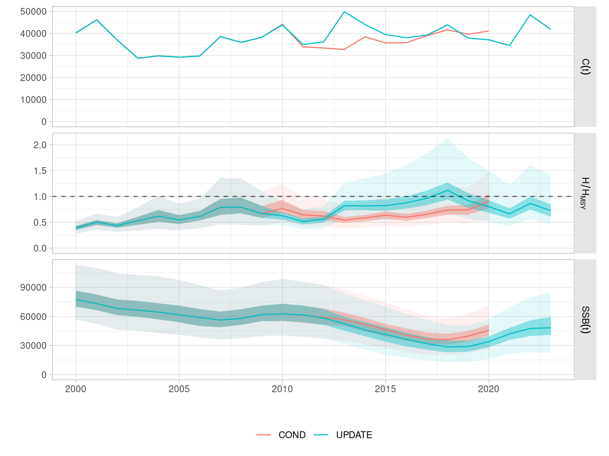
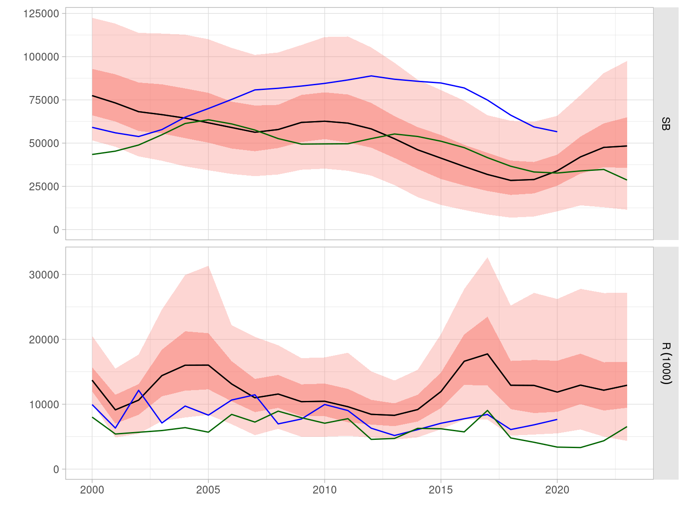
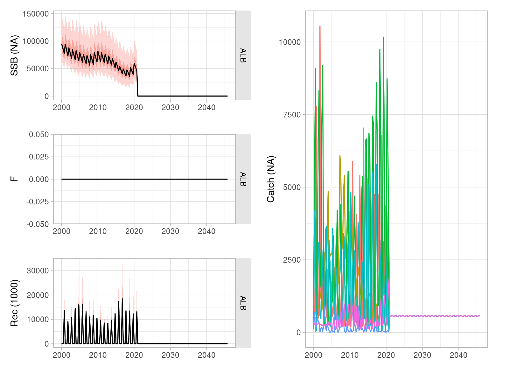

```{r knitr, echo=FALSE, message=FALSE}
library(knitr)
opts_chunk$set(echo=FALSE, message=FALSE, warning=FALSE,
  out.width="90%", fig.pos='htb')
```

# Introduction

# Conditioning of operating models

## Methods

# Operating model update

- WPTmT 2025

```{r oms-compare, fig.cap="Total catch, relative harvest rate over that at MSYm anmd SSB for the OM conditioned on the 2022 WPTmT dataset (COND), and that updated to the 2025 WPTmT dataset."}

```

```{r om-compare-sa, fig.cap="SSB as estimated by the ABC base case operating model, with the trajectories from the WPTmT 2022 SS3 stock assessment (blue) and the WPTmT 2025 model."}

```

```{r om-fwd, fig.cap="Time series of catch, relative harvest rate and SSB for two future projections of the base case OM: with no catch (C0) and for catch equal to the MSY estimated by the 2025 stock assessment model run (MSY)."}

```


# References
