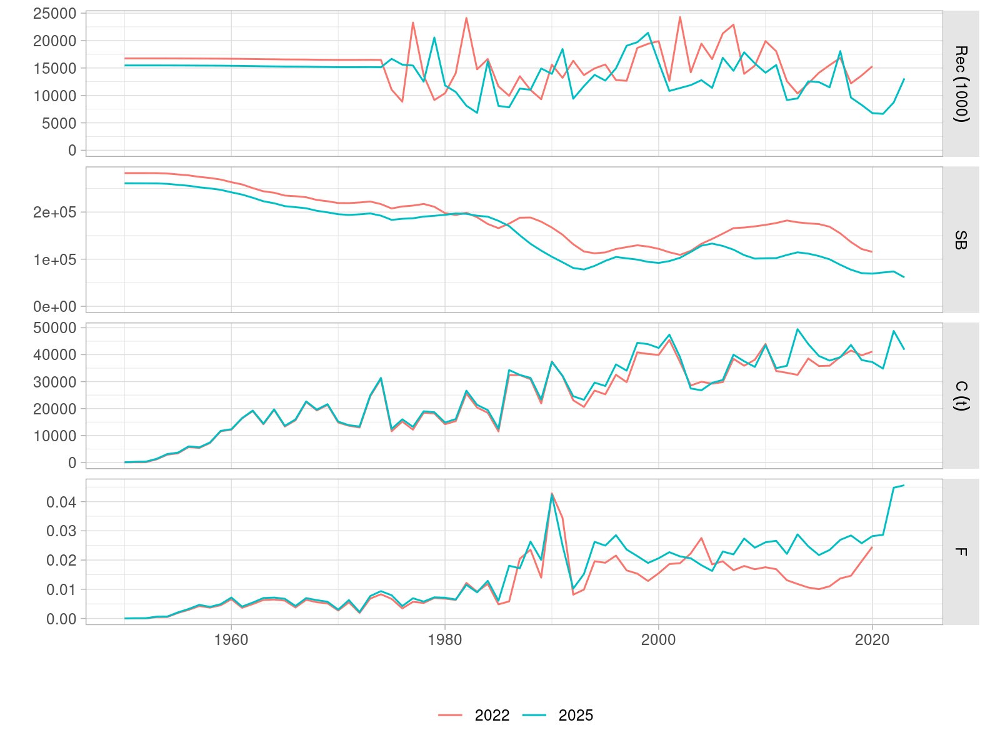

```{r knitr, echo=FALSE, message=FALSE}
library(knitr)
opts_chunk$set(echo=FALSE, message=FALSE, warning=FALSE,
  out.width="75%", fig.pos='htb')
```

# Introduction

# Operating model update

- ABC OM, refer to WPM_2024

The original conditioning of the ABC operating models employed the datasets available at that time. These were assembled for the 2022 stock assessment of albacore tuna [@WPTmT_2022]. An updated catch and CPUE dataset is now available [@WPTmT_2025] that contains data up to 2023. A revision of past catch data has also taken place. The assessment results, in both cases for the NW-CPUE models, show differences in the estimated population trajectories (Figure \@ref(fig:sas-compare)). Overall stock scale differs by 8% for both virgin SSB and recruitment.

```{r sas-compare, fig.cap="Time series of recruitment, SSB, catch and fishing mortality from the WPTmt 2022 and WPTmt 2025 SS3 base-case stock assessments."}

```

The OMs have now been updated for the new catch information, but no full reconditioning has been carried out. The OM was projected for the new nominal catch series between 2010 and 2023, with recruitment being predicted by the stock-recruit relationship, with standard lognormal deviances. The updated base case OM shows a stock that has been overexploited in the recent past but has recovered in abundance (Figure \@ref(fig:oms-compare)).

```{r oms-compare, fig.cap="Total catch, relative harvest rate over that at MSY, recruitment, and SSB for the OM conditioned on the 2022 WPTmT dataset (COND), and that updated to the 2025 WPTmT dataset."}
knitr::include_graphics("report/data_oms_compare.png")
```

The index of abundance of the base case OM, the LL CPUE series in the NW area, has been recalculated given the updated abundances but using the original estimated selectivity and catchability. Figure \@ref(fig:ids-compare) present the two quarterly indices.

```{r ids-compare, fig.cap="LLCPUE1 (NW) indices of abundance from the 2022 and 2025 stock assessments of IOTC albacore."}

```

- SSB in updated OM aligns better with the new SA
- REC differ as deviances from SRR are modelled in different ways

```{r om-compare-sa, fig.cap="SSB and recruitment as output by the ABC base case operating model, with the superimposed trajectories from the WPTmT 2022 SS3 stock assessment (blue) and the WPTmT 2025 model (green)."}
knitr::include_graphics("report/data_om_compare_sa.png")
```

- FWD(C=MSY) and FWD(C=0) plots give a useful indication of the medium-term likely dynamics of the stock for harvest rates that are below the MSY harvest rate 

```{r om-fwd, fig.cap="Time series of catch, relative harvest rate, recruitment and SSB for two future projections of the base case OM: with no catch (C0) and for catch equal to the MSY estimated by the 2025 stock assessment model run (MSY)."}

```

\clearpage

# Exploration of candidate management procedures

- Time period
- Tuning period
- Performance statistics
  - Kobe green HR/HRFMSY

## Exploration of catch levels through a constant catch MP

- C = 41719
- No TAC limits

```{r ccatch, fig.cap="Time series of catch, relative harvest rate, recruitment and SSB for the base case OM projected under a constant catch MP, and tuned to obtain a P(Kobe=green) of 60% over the 2034-2038 period."}
knitr::include_graphics("report/model_ccatch.png")
```

The constant catch MP, while obviously not considered usable in reality, can be an extremely useful tool when it comes to the design and tuning of more dynamic MPs (either empirical or model-based). Specifically, it gives the MP designer an idea of what general level of medium term catches are likely to be required to achieve the tuning target. If the constant catch MP exceeds/is below the current catch level then future MP-calculated catches probably need to increase/decrease on average. As can be seen in Figure 6 the estimated constant catch that meets the tuning criteria (41,719t) is very close indeed to the 2023 catch level of around 41,800t. This already implies a number of features required to be built into for example an empirical MP driven by a single LL CPUE index:

  1. That current average CPUE is likely to be somewhere close to where we want the MP to keep the fishery 
  2. Any target-type or "buffer-zone" behaviour in the MP needs to reflect this or the MP will be unbalanced, in that it is trying to change the TAC when there is no need. If not the MP will almost certainly struggle to tune to the relevant objectives
  3. Any limit-like behaviour in the MP (where the TAC is rapidly reduced as CPUE declines) need to be cognisant of where the "target" levels likely are
  4. Any feature for the MP to increase catches above the "target" CPUE needs to reflect where that target is likely located
  5. Be careful not to unintentionally program the MP with a limited ability to act on more extreme robustness trials. This can be a problem when we need to tune an MP where little catch variation is required to reach to tuning target


## cpue.ind + bufferdelta.hcr

- TEST

- TUNING

# Next steps

- FINALIZE tuning model-free
- RUNS on robustness OMs
- ADD CC robustness, DEFINE w/WPTmT
- TEST under IEM
- OEM catch error, 20% - 30%
- RUN all for jabba.sa + bufferdelta.hcr(depletion)
- REPORT by start of DEC 2026
- CIRCULATE to interested parties
- PRESENT at WPM MSE FEB 2026

# Acknowledgements

# References

