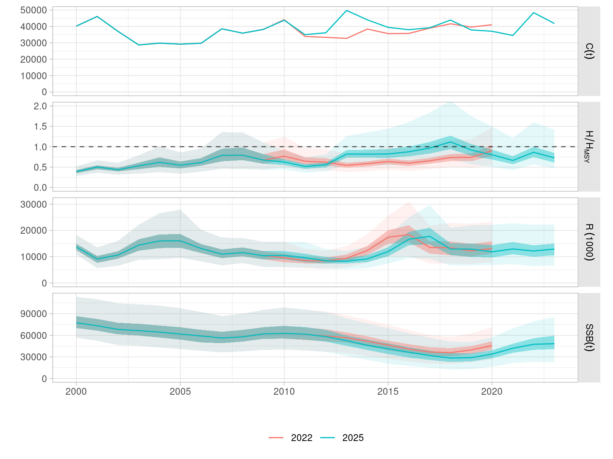

```{r knitr, echo=FALSE, message=FALSE}
library(knitr)
opts_chunk$set(echo=FALSE, message=FALSE, warning=FALSE,
  out.width="65%", fig.align="center", fig.pos='htb')
```

# Introduction

Operating Models (OMs) for Indian ocean albacore tuna stock and fishery have been developed based a methodology that uses inputs and results from the stock assessment, but simplifies the structure and emphasizes the quantification of relevant uncertainties. Approximate Bayesian Computation is then employed to flexibly condition to available data without the need to define a full likelihood, while employing McMC (Markov chain Monte Carlo) approaches to robustly incorporate prior information. These OMs have now been updated to include the new data that the recent stock assessment exercise for the stock [@WPTmT_2025] has made available.

The operating models selected by WPM [@WPM_2024] are being employed to develop and test management procedures (MPs) for the stock. Initial runs of a model-free MP are described here, and the next steps for the finalization of this analysis are listed for WPM discussion.

# Operating model update

Three operating models are included in the current set, following the suggestion of WPM [@WPM_2024]. The reference OM is defined as the model that includes LL CPUE 1 (NW), with SSB priors, recruitment variability, and the overfishing penalty. Robustness OMs include the addition of a 1% effort creep. Please refer to the working documents presented on further details about the OM formulation and the ABC method for conditioning.

The original conditioning of the ABC operating models employed the datasets available at that time. These were assembled for the 2022 stock assessment of albacore tuna [@WPTmT_2022]. An updated catch and CPUE dataset is now available [@WPTmT_2025] that contains data up to 2023. A revision of past catch data has also taken place. The assessment results, in both cases for the NW-CPUE models, show differences in the estimated population trajectories (Figure \@ref(fig:sas-compare)). Overall stock scale differs by 8% for both virgin SSB and recruitment.

```{r sas-compare, fig.cap="Time series of recruitment, SSB, catch and fishing mortality from the WPTmt 2022 and WPTmt 2025 SS3 base-case stock assessments."}
knitr::include_graphics("report/data_sas_compare.png")
```

The OMs have now been updated for the new catch information, but no full reconditioning has been carried out. The OM was projected for the new nominal catch series between 2010 and 2023, with recruitment being predicted by the stock-recruit relationship, with standard lognormal deviances. The updated base case OM shows a stock that has been overexploited in the recent past but has recovered in abundance (Figure \@ref(fig:oms-compare)).

```{r oms-compare, fig.cap="Total catch, relative harvest rate over that at MSY, recruitment, and SSB for the OM conditioned on the 2022 WPTmT dataset (COND), and that updated to the 2025 WPTmT dataset."}

```

The index of abundance of the base case OM, the LL CPUE series in the NW area, has been recalculated given the updated abundances but using the original estimated selectivity and catchability. Figure \@ref(fig:ids-compare) presents the two quarterly indices.

```{r ids-compare, fig.cap="LLCPUE1 (NW) indices of abundance from the 2022 and 2025 stock assessments of IOTC albacore."}
knitr::include_graphics("report/data_id1_compare.png")
```

The stock assessment estimates of SSB and recruitment, as annual time series, are shown in Figure \@ref(fig:om-compare-sa), on top of those from the updated base case OM. The OM SSb trend aligns now with that from the recent stock assessment, falling within the 80% confidence bounds, although they diverge in recent years. The recruitment series differ in the last half of the period. This might be related to differences in modelling of deviances over the tock-recruit relationship, or the timing between spawning and settlement, which is not considered in the OM population model.

```{r om-compare-sa, fig.cap="SSB and recruitment as output by the ABC base case operating model, with the superimposed trajectories from the WPTmT 2022 SS3 stock assessment (blue) and the WPTmT 2025 model (green)."}
knitr::include_graphics("report/data_om_compare_sa.png")
```

Projections for fixed catch levels have been carried to evaluate the dynamics of the updated OM. Those at zero catch and catch equal to the estimate of MSY from the 2025 stock assessment are shown in Figure \@ref(fig:om-fwd). As expected, a proportion of OM iterations (20%) cannot sustain those catch levels without falling below 10% of virgin SSB (SB0) by 2045.

```{r om-fwd, fig.cap="Time series of catch, relative harvest rate, recruitment and SSB for two future projections of the base case OM: with no catch (C0) and for catch equal to the MSY estimated by the 2025 stock assessment model run (MSY)."}
knitr::include_graphics("report/data_om_fwd.png")
```

\clearpage

# Exploration of candidate management procedures

Simulations on the updated OM start in 2023, with a TAC being set for the 2024-2026 period and then every three years until 2045. The period used to assess performance for tuning purposes is 2034-2038.

The full set of performance statistics employed in other IOTC stocks is being computed here, with a difference being introduce to accommodate the harvesting dynamics employed in the ABC OM. Rather than the average fishing mortality over an age range ($\bar{F}$), exploitation level is being computed using the relative harvest rate over the $HR_{MSY}$ reference point. Harvest rate itself, $HR$, is computed as the sum across the six fisheries of the ratio between their seasonal catch and the vulnerable biomass given their individual selectivity. An average across all four seasons provides the annual exploitation metric, as follows

$$ HR = \sum_{s=1}^{4} (\sum_{f=1}^{6} (C_{fs} / \sum_{a=0}^{14}(N_as \cdot W_as \cdot S_{fas}))) / 4 $$

where $s$ refers to season 1 to 4, $f$ is the fishery number, and $a$ are ages from 0 to 14. Individual harvest rates by fishery and season are limited to 0.90, both in OM conditioning and calculation during simulations. We have chosen to report this metric always as relative to the $HR_{MSY}$ value. The Kobe performance statistics are thus computed using this $HR/HR_{MSY}$ metric, combined with the usual $SSB/SSB_{MSY}$ commonly employed.

## Exploration of catch levels through a constant catch MP

The constant catch MP, while obviously not considered usable in reality, can be an extremely useful tool when it comes to the design and tuning of more dynamic MPs (either empirical or model-based). Specifically, it gives the MP designer an idea of what general level of medium term catches are likely to be required to achieve the tuning target. If the constant catch MP exceeds/is below the current catch level then future MP-calculated catches probably need to increase/decrease on average. As can be seen in Figure 6 the estimated constant catch that meets the tuning criteria (41,719t) is very close indeed to the 2023 catch level of around 41,800t. This already implies a number of features required to be built into for example an empirical MP driven by a single LL CPUE index:

  1. That current average CPUE is likely to be somewhere close to where we want the MP to keep the fishery 
  2. Any target-type or "buffer-zone" behaviour in the MP needs to reflect this or the MP will be unbalanced, in that it is trying to change the TAC when there is no need. If not the MP will almost certainly struggle to tune to the relevant objectives
  3. Any limit-like behaviour in the MP (where the TAC is rapidly reduced as CPUE declines) need to be cognisant of where the "target" levels likely are
  4. Any feature for the MP to increase catches above the "target" CPUE needs to reflect where that target is likely located
  5. Be careful not to unintentionally program the MP with a limited ability to act on more extreme robustness trials. This can be a problem when we need to tune an MP where little catch variation is required to reach to tuning target

```{r ccatch, fig.cap="Time series of catch, relative harvest rate, recruitment and SSB for the base case OM projected under a constant catch MP, and tuned to obtain a P(Kobe=green) of 60% over the 2034-2038 period."}
knitr::include_graphics("report/model_ccatch.png")
```

## Model-free management procedure

A model-free management procedure being applied to the albacore OMs is formulated ass follows. A single index of abundance, the NW quarterly LL CPUE in the base case OM, is averaged over the last three years. A z-score transformation of the index is used as input metric to the HCR for normalization purposes. This metric is employed on a catch-based HCR that contains two buffer values, a lower limit, and increases catch at larger metric values as defined by the slope of the output line (Figure \@ref(fig:buffer-hcr)).

```{r buffer-hcr, fig.cap="Diagramatic representation of the buffer HCR.", out.width="50%"}
knitr::include_graphics("boot/initial/report/buffer_hcr.png")
```

Tests have been carried out of two initial formulations of this rule. The first sets total catch and is tuned by this catch level (*Target*), while lower and upper buffers, as aell as limit and slope, are set at fixed values. From this an exploration of the impact of a range of alternative values for those four arguments is being carried out.

An initial tuning exercise on an MP using this HCR, with limits of 15% to changes in catch every three years in both directions, led to a target catch level of 40,000 t (Figure \@ref(fig:buffer-catch)), again very similar to current catches.

```{r buffer-catch, fig.cap="Time series of catch, relative harvest rate, recruitment and SSB for the base case OM projected under a constant catch MP, and tuned to obtain a P(Kobe=green) of 60% over the 2034-2038 period."}

```

Given the considerations exposed above on the characteristics that a successful MP for this stock should contain, work has moved on to a formulation of this HCR in which the output consists of a catch multiplier, rather than a total catch value. This multiplier is applied over the previous TAC, or the catch of the last year before MP application at the start. Tuning for this MP is being carried out but could not be completed in time.

\clearpage

# Next steps

Work will continue on this project until the end of 2025. The subsequent results will be made available to all WPM and WPTmT participants. The intended workplan includes at this stage the following tasks:

- Finalize tuning of the proposed model-free MP.
- Finalize a set of climate-change robustness scenarios
- Test the tuned MPs on the robustness OMs (using the SW CPUE and considering effort creep), and on the climate-change scenarios.
- Test MPs under some observation error scenarios that consider errors and/or subsequent revisions in estimation of total catches.
- Evaluate the robustness of MPs to a range of implementation error levels.
- Explore a model-based MP that employs a surplus production model as indicator of depletion level, combined with the HCR employed in the model-free MP.

A complete reconditioning of the OMs around the updated datasets is not being considered, but the feedback of the WPM on this matter will be adopted by the authors. Use of recruitment deviances as estimated by the new assessment in the hindcasting procedure could alter the final year status of the updated OM. Information on recruitment in this model is limited at best, given the selectivity of the fleets involved, so the quality of estimates, specially for recent cohorts is probably limited.

# Acknowledgements

Work by IM was funded by the Indian Ocean Tuna Commission (IOTC/FAO). ork by RH was funded by the Department of Foreign Affairs and Trade of the Government of Australia.

# References

